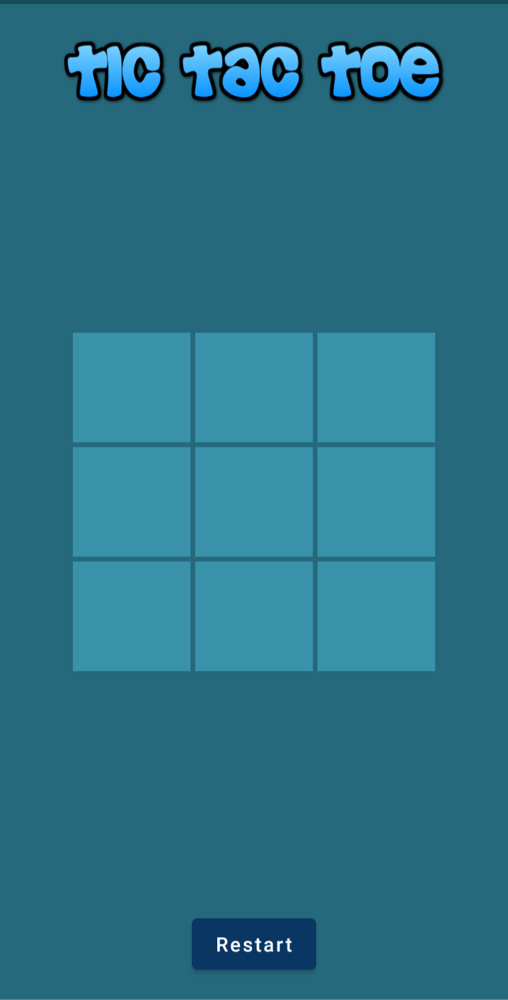
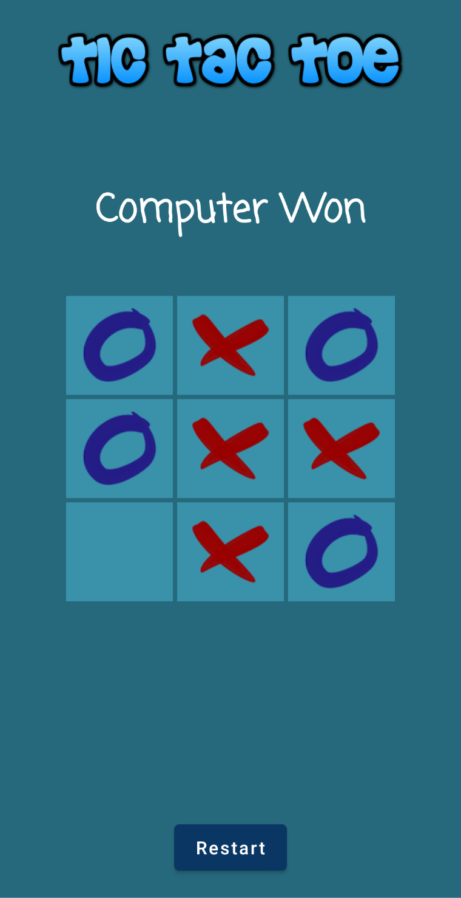
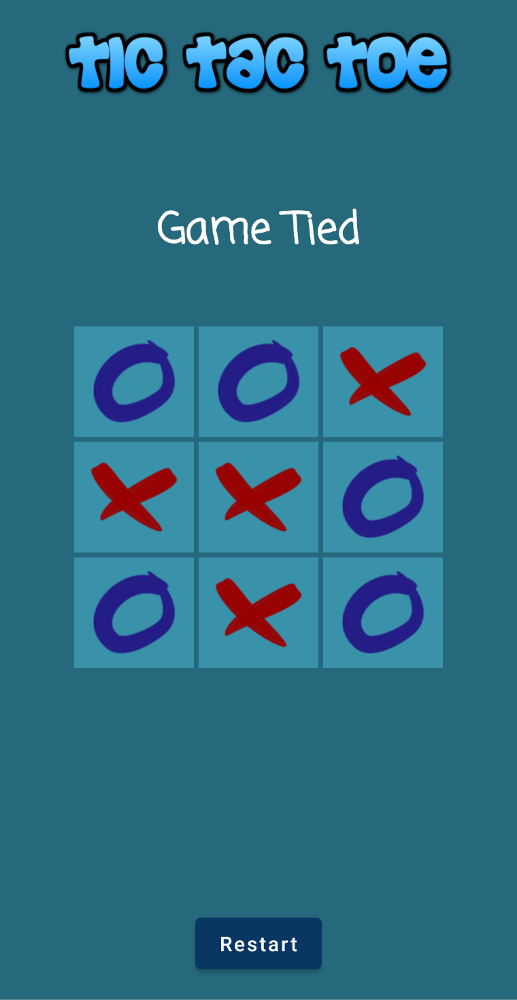

# TicTacToe
Tic Tac Toe Game
What’s Tic-Tac-Toe?
Tic-Tac-Toe is a two player’s game played in 3 x 3 grid box usually using Xs and Os; a player
can win, lose or draw.

### MINIMAX_Algorithm
It’s a decision-making approach which finds the best next move; and it’s being used here.
Two players: Maximizer tries to maximize the chances of winning and Minimizer tries to
minimize the chances of Maximizer's winning.
According to Wikipedia, if player A can win in one move, their best move is that winning move.
If player B knows that one move will lead to the situation where player A can win in one move,
while another move will lead to the situation where player A can, at best, draw, then player B's
best move is the one leading to a draw. Late in the game, it's easy to see what the "best" move is.
The Minimax algorithm helps find the best move, by working backwards from the end of the
game. At each step it assumes that player A is trying to maximize the chances of A winning,
while on the next turn player B is trying to minimize the chances of A winning (i.e., to maximize
B's own chances of winning).
In other words and with respect to the implementation of my project, when it’s computer’s
turn, with every move it adds +1 if win, -1 if lose and 0 if draw, and selects the move with
maximum score.

      

